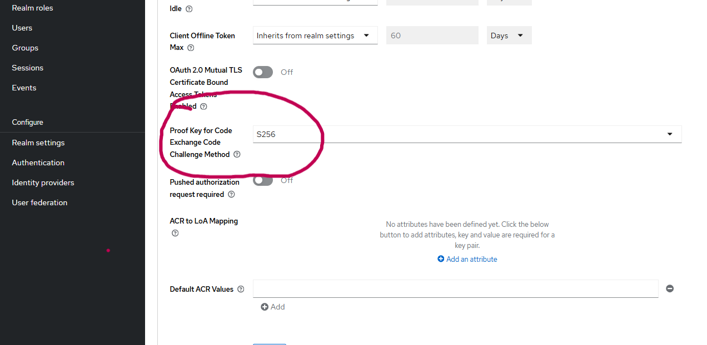
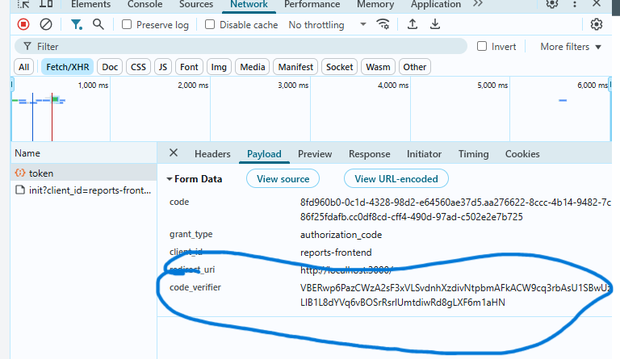
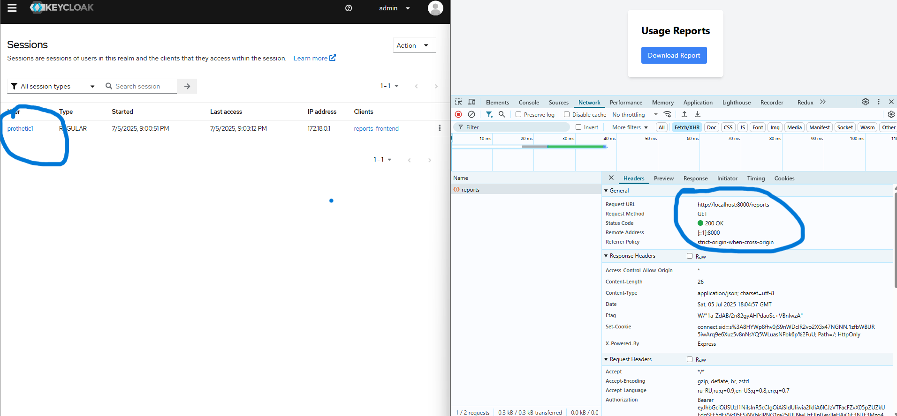
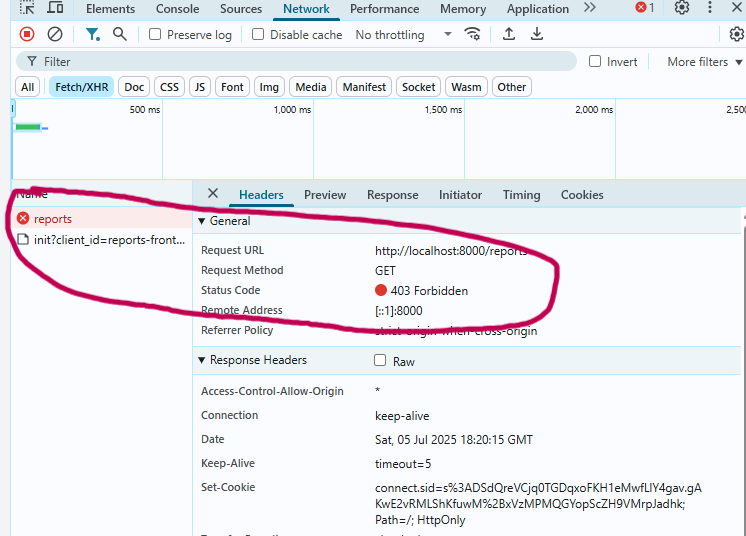
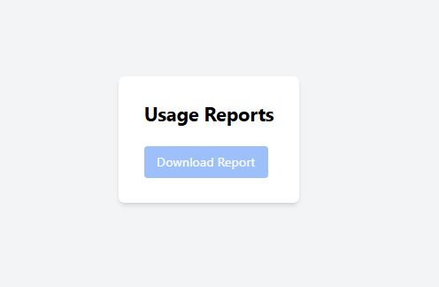

1. Запуск сервисов
```bash
  docker-compose up --build -d
```

2. Настройка PKCE в Keycloak




3. В запросе на токен теперь передается `code-verifier`




4. Пользователь с ролью `prothetic_user` может получить данные от эндпоинта `/reports`




5. Пользователь без роли `prothetic_user` получает от эндпоинта `/reports` ошибку




6. Так же проверка роли пользователя осуществляется на `frontend`. Если прав на доступ к отчету нет - кнопка выгрузки отчета получает аттрибут `disabled`

